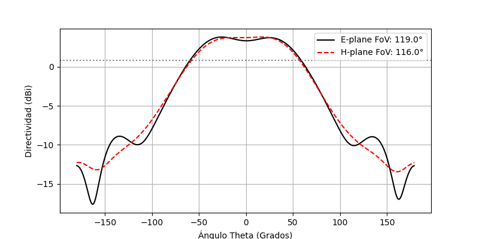

# Electromagnetic Digital Twin: Cross-Patch DOA Antenna Array

*([Leer en Español](README_es.md))*

This repository implements a full-wave electromagnetic Digital Twin for a planar microstrip antenna array in a cross configuration, specifically designed to rigorously evaluate Direction of Arrival (DOA) estimation algorithms.

Unlike standard theoretical signal processing models that assume isotropic and point-source antennas in a vacuum, this model captures real hardware physics. By numerically solving Maxwell's equations, the simulation exposes DOA algorithms to non-ideal conditions: mutual coupling, finite substrate diffraction, and Active Element Patterns.

---

## 1. Geometric Design Fundamentals and Materials

The radiant design and material selection respond to strict trade-offs between RF performance and digital processing viability.

### 1.1 Parameter Space and Optimization
The code defines a continuous search space: resonant frequency ($f_0$), patch size ($D$), relative wavelength spacing ($Divisor$), and cross angle ($\alpha$). Exposing these variables allows coupling this digital twin to a heuristic optimizer (e.g., Bayesian) to find the topology that minimizes the DOA localization Root Mean Square Error ($RMSE$), while maintaining impedance matching ($S_{11} \le -10\text{ dB}$, equivalent to a $SWR \le 2.0$).

### 1.2 Circular Polarization and Asymmetric Geometry ($L_{corte}$)
In satellite or radar applications, linear polarization is vulnerable to Faraday rotation and multipath fading. To avoid this, the corners of the square patch are truncated. This asymmetry perturbs the degenerate fundamental modes $TM_{10}$ and $TM_{01}$, splitting the resonance into two orthogonal modes with an intrinsic $90^\circ$ phase shift. The result is a **Circularly Polarized (CP)** antenna fed by a single port.

### 1.3 Materials and Mutual Coupling (Cross Talk)
* **Dielectric Substrate (FR4):** Modeled using FR4 ($\epsilon_r = 4.5$). The FDTD engine captures the high tangent losses of this material via the effective conductivity ($\kappa$). Given the dense structure, mutual coupling (Cross Talk) between adjacent ports is a critical factor that corrupts signal phase. The simulator extracts the maximum $S_{21}$ parameter to quantify this energy leakage.
* **SMA Coaxial Feed:** The modeling includes the copper pin and the Teflon dielectric ($\epsilon_r = 2.1$). The radii ratio guarantees a $Z_0 = 50 \Omega$ characteristic impedance, preventing spurious reflections in the transmission line.

### 1.4 Computational Multi-Fidelity ($t_{cobre}$)
To balance precision and computational cost, two regimes are implemented:
1.  **2D Fidelity ($t_{cobre} = 0.0$):** The patch is a zero-thickness polygon (PEC). This drastically relaxes the Courant-Friedrichs-Lewy (CFL) condition on the Z-axis, allowing ultra-fast simulations during geometric exploration phases.
2.  **3D Fidelity ($t_{cobre} > 0.0$):** Models the physical copper thickness (e.g., $35\text{ }\mu\text{m}$). It captures the exact fringing fields at the metal edges, serving as a strict validation before hardware manufacturing.

---

## 2. Computational Physics (Time Domain)

Near-field resolution is executed using the FDTD (*Finite Difference Time Domain*) algorithm.

### 2.1 Mesh Stability and Numerical Dispersion
The spatial Yee grid maintains strict sub-metric discretization ($\Delta \le \lambda/20$). A coarser mesh would introduce numerical dispersion, causing the wave's phase velocity to artificially depend on its propagation direction. This would destroy the spatial phase coherence that DOA algorithms require to operate.

### 2.2 NF2FF Transformation and Active Manifold
FDTD solves the fields strictly within a volume bounded by Perfectly Matched Layers (PML). To calculate the radiation at infinity (Fraunhofer region), the Huygens Equivalence Principle is applied over a closed virtual box.

The fundamental deliverable of this simulation is the complex Steering Vector (or Manifold) $\mathbf{A}(\theta)$. Unlike the ideal analytical model ($\mathbf{a}(\theta) = e^{-j \mathbf{k} \cdot \mathbf{r}}$), this vector extracts the pure electromagnetic footprint: the "shadowing" of inactive patches and the individual phase center shift induced by the corner truncations.

---

## 3. Spatial Signal Processing (DSP)

A deterministic DOA scenario (e.g., targets at $-25^\circ$ and $+25^\circ$) submerged in Additive White Gaussian Noise ($SNR = 15\text{ dB}$) is injected into the physical manifold. With this synthetic data $\mathbf{X}$, the spatial covariance matrix is estimated:
$$\mathbf{R}_x = \frac{1}{L} \mathbf{X} \mathbf{X}^H$$

### 3.1 The Physical Limit: Bartlett Beamforming
The classical estimator maximizes the output power by steering the array's beam:
$$P_{Bartlett}(\theta) = \mathbf{a}^H(\theta) \mathbf{R}_x \mathbf{a}(\theta)$$
In a cross array, a 1D scan produces a power distribution equivalent to a binomial array (higher weight in the center). Physically, this suppresses side lobes but critically widens the main lobe, demonstrating the hardware's Rayleigh diffraction limit.

### 3.2 Mathematical Super-Resolution: MUSIC
To break the Rayleigh barrier, the *Multiple Signal Classification* algorithm isolates the noise subspace $\mathbf{E}_n$ via the eigenvalue decomposition of $\mathbf{R}_x$. The pseudo-spectrum exploits the orthogonality between the actual signal vectors and this subspace:
$$P_{MUSIC}(\theta) = \frac{1}{\mathbf{a}^H(\theta) \mathbf{E}_n \mathbf{E}_n^H \mathbf{a}(\theta)}$$
The simulator extracts this peak's sharpness and the localization Root Mean Square Error ($RMSE$).
