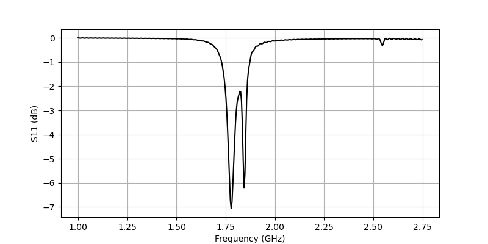
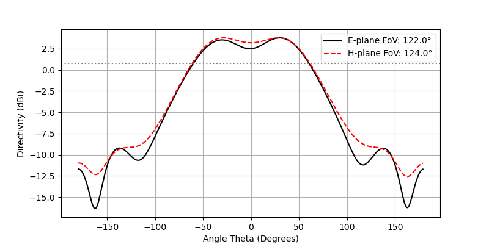

# Gemelo Digital Electromagnético: Arreglo DOA de Parches en Cruz

Este repositorio implementa un gemelo digital electromagnético (*Digital Twin*) *full-wave* para un arreglo planar de antenas microstrip en configuración de cruz, diseñado para la evaluación rigurosa de algoritmos de estimación de Dirección de Arribo (DOA).

A diferencia de los modelos teóricos de procesamiento de señales que asumen antenas isotrópicas y puntuales en el vacío, este modelo captura la física real del hardware. Al resolver numéricamente las ecuaciones de Maxwell, la simulación expone a los algoritmos DOA a condiciones no ideales: acoplamiento mutuo (*mutual coupling*), difracción finita en los bordes del sustrato y diagramas de radiación distorsionados (*Active Element Patterns*).

---

## 1. Fundamentos del Diseño Geométrico y Materiales

El diseño radiante y la selección de materiales responden a compromisos estrictos entre el rendimiento de RF y la viabilidad de procesamiento digital.

### 1.1 El Espacio de Parámetros y Optimización
El código define un espacio de búsqueda continuo: la frecuencia de resonancia ($f_0$), el tamaño del parche ($D$), la separación relativa a la longitud de onda ($Divisor$) y el ángulo de la cruz ($\alpha$). Exponer estas variables permite acoplar el simulador a un optimizador heurístico (ej. Bayesiano) para buscar la topología que minimice el Error Cuadrático Medio ($RMSE$) de localización, manteniendo la adaptación de impedancia ($S_{11} \le -10\text{ dB}$, equivalente a un $SWR \le 2.0$).

### 1.2 Polarización Circular y Geometría Asimétrica ($L_{corte}$)
En aplicaciones satelitales o de radar, la polarización lineal es vulnerable a la rotación de Faraday y al efecto multitrayecto. Para evitarlo, se truncan las esquinas del parche cuadrado. Esta asimetría perturba los modos degenerados fundamentales $TM_{10}$ y $TM_{01}$, dividiendo la resonancia en dos modos ortogonales con un desfase intrínseco de $90^\circ$. El resultado es una antena de **Polarización Circular (CP)** alimentada por un único puerto.

### 1.3 Materiales y Acoplamiento Mutuo (Cross Talk)
* **Sustrato Dieléctrico (FR4):** Se utiliza FR4 ($\epsilon_r = 4.5$). El motor FDTD captura las altas pérdidas tangenciales de este material mediante la conductividad efectiva ($\kappa$). Al ser una estructura densa, el acoplamiento mutuo (Cross Talk) entre puertos adyacentes es un factor crítico que corrompe la fase de la señal. El simulador extrae el parámetro $S_{21}$ máximo para cuantificar esta fuga de energía.
* **Alimentación Coaxial (SMA):** El modelado incluye el pin de cobre y el dieléctrico de teflón ($\epsilon_r = 2.1$). La relación de radios garantiza una impedancia característica $Z_0 = 50 \Omega$, previniendo reflexiones espurias en la línea de transmisión.

### 1.4 Multi-Fidelidad Computacional ($t_{cobre}$)
Para equilibrar precisión y costo computacional, se implementan dos regímenes:
1.  **Fidelidad 2D ($t_{cobre} = 0.0$):** El parche es un polígono de espesor nulo (PEC). Relaja la condición de Courant-Friedrichs-Lewy (CFL) en el eje Z, permitiendo simulaciones rápidas en fases de exploración geométrica.
2.  **Fidelidad 3D ($t_{cobre} > 0.0$):** Modela el espesor físico del cobre (ej. $35\text{ }\mu\text{m}$). Captura los *fringing fields* exactos en los bordes del metal, sirviendo como validación estricta antes de la fabricación.

---

## 2. Física Computacional (Dominio del Tiempo)

La resolución del campo cercano se ejecuta mediante el algoritmo FDTD (*Finite Difference Time Domain*).

### 2.1 Estabilidad de Malla y Dispersión Numérica
La grilla de Yee espacial mantiene una discretización estricta ($\Delta \le \lambda/20$). Una malla más gruesa introduciría dispersión numérica, provocando que la velocidad de fase de la onda dependa de su dirección de propagación. Esto destruiría la coherencia de fase espacial que los algoritmos DOA necesitan para operar.

### 2.2 Transformación NF2FF y el Manifold Activo
FDTD resuelve los campos dentro de un volumen acotado por capas absorbentes (PML). Para calcular la radiación en el infinito (zona de Fraunhofer), se aplica el Principio de Equivalencia de Huygens sobre una caja virtual cerrada.

El entregable fundamental de la simulación es el *Steering Vector* o *Manifold* complejo $\mathbf{A}(\theta)$. A diferencia del modelo analítico ideal ($\mathbf{a}(\theta) = e^{-j \mathbf{k} \cdot \mathbf{r}}$), este vector extrae la huella electromagnética pura: el "sombreado" de los parches inactivos y el desplazamiento del centro de fase individual inducido por el truncado de las esquinas.

---

## 3. Procesamiento de Señales Espaciales (DSP)

Se inyecta un escenario DOA determinista en el manifold físico (ej. blancos en $-25^\circ$ y $+25^\circ$) sumergido en ruido térmico aditivo ($SNR = 15\text{ dB}$). Con estos datos sintéticos $\mathbf{X}$, se calcula la matriz de covarianza espacial:
$$\mathbf{R}_x = \frac{1}{L} \mathbf{X} \mathbf{X}^H$$

### 3.1 El Límite Físico: Beamforming de Bartlett
El estimador clásico maximiza la potencia de salida orientando el haz del arreglo:
$$P_{Bartlett}(\theta) = \mathbf{a}^H(\theta) \mathbf{R}_x \mathbf{a}(\theta)$$
En un arreglo en cruz, un escaneo 1D produce una distribución de potencia equivalente a un arreglo binomial (mayor peso en el centro). Físicamente, esto suprime los lóbulos secundarios pero ensancha críticamente el lóbulo principal, evidenciando el límite de difracción de Rayleigh del hardware.

### 3.2 Super-Resolución Matemática: MUSIC
Para romper la barrera de Rayleigh, el algoritmo *Multiple Signal Classification* aísla el subespacio de ruido $\mathbf{E}_n$ mediante la descomposición en autovalores de $\mathbf{R}_x$. El pseudo-espectro explota la ortogonalidad entre los vectores de señal y este subespacio:

$$P_{\text{MUSIC}}(\theta) = \frac{1}{\mathbf{a}^H(\theta) \mathbf{E}_n \mathbf{E}_n^H \mathbf{a}(\theta)}$$

El simulador extrae la agudeza de este pico y el Error Cuadrático Medio ($RMSE$). Si el acoplamiento mutuo o la asimetría del hardware destruyen la coherencia de fase, el RMSE diverge, demostrando que la topología es inviable para estimación DOA.

## [v1.1.0] - 2026-03-22
### Actualización de Física FDTD: Calibración de malla y anclaje del puerto SMA

Esta actualización soluciona problemas de corrimiento de frecuencia y resonancias falsas mejorando la fidelidad del modelo electromagnético en openEMS.

**Correcciones y Cambios:**
* **Malla ajustada al dieléctrico (Dielectric-aware Mesh):** La resolución base de la malla ahora se escala por la permitividad relativa del sustrato ($\sqrt{\epsilon_r}$). Esto evita el sub-muestreo de la onda electromagnética dentro del FR4 y corrige errores graves de corrimiento en la frecuencia de resonancia.
* **Anclaje de la malla en la alimentación (Feed Mesh Anchoring):** Se forzaron líneas de malla exactas en las coordenadas espaciales del punto de alimentación. Esto elimina los errores de interpolación matemática del simulador durante la inyección de voltaje.
* **Colisión del Lumped Port:** Se eliminó el cilindro de cobre (PEC) redundante que se superponía con el `LumpedPort` 1D. Esto soluciona un cortocircuito numérico que ocurría al simular pines físicos con dimensiones comerciales realistas (diámetro de 0.5 mm / radio interior de 0.25 mm), restaurando el comportamiento inductivo correcto del modelo.
