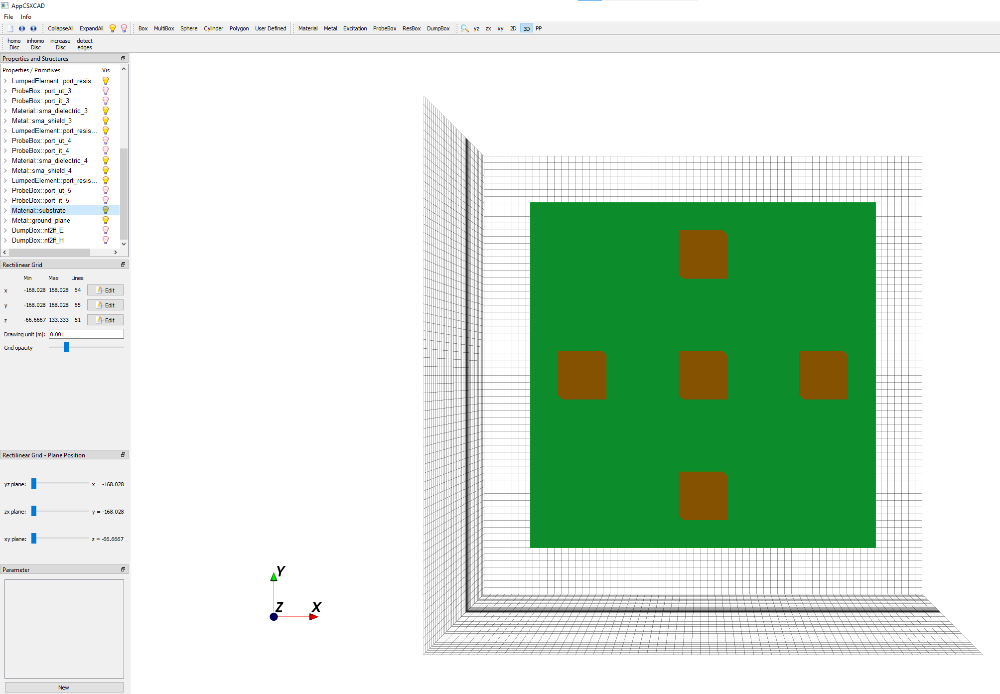

# Computational Architecture and Reproducibility

This document details the software requirements and data flow structure necessary to execute the Digital Twin locally. The code was designed prioritizing electromagnetic engine stability and post-processing automation.

## 1. Environment and Dependencies

The FDTD simulator is not a standard Python library; it requires a specific installation of the **openEMS** engine on the operating system.

### 1.1 openEMS Engine (Electromagnetic Core)
* It is mandatory to have openEMS installed (Windows/Linux binaries).
* The script injects the openEMS path directly into the Windows `PATH` during execution to avoid environment variable conflicts.
* **Default path in script:** `C:\Users\herce\openEMS\openEMS`. *(Modify the `openems_path` variable in Section 1 if your installation is in another directory).*

### 1.2 Python Environment (Conda)
It is recommended to isolate dependencies using a Conda environment. The libraries required for DSP post-processing and metric generation are standard:
* `numpy`: For matrix algebra, SWR calculation, and DOA algorithms (Eigenvalue decomposition).
* `matplotlib`: For silent export of radiation patterns and MUSIC/Bartlett spectrums.
* `CSXCAD`: Geometry interface (included with openEMS).

## 2. Execution Flow (Pipeline)

The script operates as an evaluating "black box". It requires no manual intervention once initiated.

1. **Pre-processing (Geometry):** Generates the planar cross based on the provided parameter space (frequency, dimensions, materials).
2. **Sequential Excitation:** Launches 5 isolated FDTD simulations. In each, it injects a Gaussian pulse into one port while the other four act as passive $50 \Omega$ matched loads.
3. **Multi-fidelity Validation:** Before simulating the entire sweep, the `verificar_primera_geometria = True` flag automatically opens the 3D interface (AppCSXCAD) on the first iteration. This allows for visual auditing of mesh snapping and physical structure before committing hours of compute time.

4. **NF2FF Transformation:** Projects the calculated fields to the Fraunhofer zone, extracting the complex *Manifold*.
5. **DSP Post-processing:** Injects white noise (user-defined SNR) and calculates the Bartlett and spatial MUSIC spectrums.

## 3. Output Structure

To prevent memory saturation during long sweeps, chart generation (`plt.show()`) is suppressed. All results are written non-volatilely to the disk.

For each simulation, the script generates an isolated folder containing:
* `simp_patch_array.xml`: The raw geometry file for AppCSXCAD inspection.
* `1_S11_Matching.png`: Impedance matching and resonance chart.
* `2_Physical_FoV.png`: Radiation lobe cut (E and H Planes).
* `3_DOA_Spectrum.png`: Superposition of the DOA algorithms' pseudo-spectrum.

Finally, the script unifies the metrics from all iterations into a master `Sweep_Report.txt` file with a standard table format, ideal for subsequent parsing by a Bayesian Optimization script.
